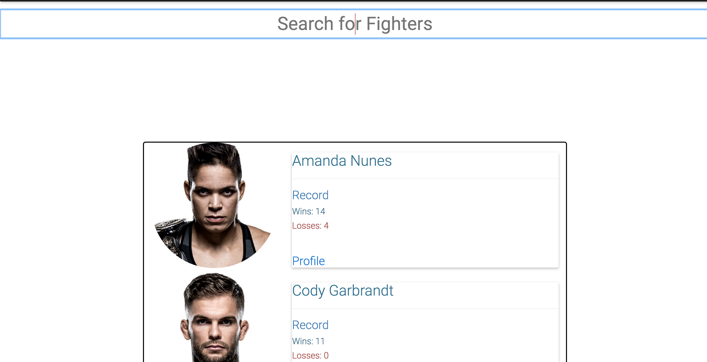
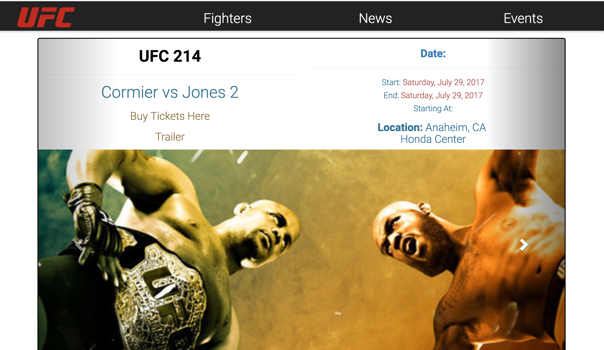

<h1>UFC Daily News</h1>
<h4>Created by: Tim Muangkeo</h4>

<h2>Intro</h2>

A fan based web page for UFC enthusiast. Dedicated to all UFC fans.

<h2>Technologies Used</h2>
<ul>
    <li>HTML5
    <li>CSS</li>
    <li>AngularJS</li>
    <li>Node.js/Express.js</li>
    <li>UFC API: Grabs information of all fighters, news, events, ect.</li>
</ul>

<h2>Idea</h2>

As a avid UFC fan, I created a dyanmic website all UFC and Web developers can appreciate.

 

<h2>Title holders/Fighter Search</h2>

Up to date title holders

 

 
<h2>News/Articles</h2>

The most up to date activities revolving the UFC

 
<h2>Events/UFC PPV</h2>

UFC events with relative information such as date, trailer, ticket prices, ect.

<h2>Coming Soon</h2>

<li>Video Search</li>
<li>Image gallery</li>
<li>Mobile Responsive</li>